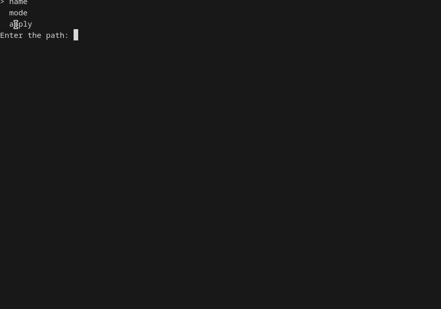

```text
                            ___    ___      
                           /\_ \  /\_ \     
  ____  __  __  __     __  \//\ \ \//\ \    
 /',__\/\ \/\ \/\ \  /'__`\  \ \ \  \ \ \   
/\__, `\ \ \_/ \_/ \/\ \L\.\_ \_\ \_ \_\ \_ 
\/\____/\ \___x___/'\ \__/.\_\/\____\/\____\
 \/___/  \/__//__/   \/__/\/_/\/____/\/____/

```

---



---

# swall

**swall** is a lightweight terminal user interface (TUI) written in Rust that helps you generate and apply wallpaper commands for Wayland wallpaper backends such as **swww** and **swaybg**.

It provides a simple keyboard-driven interface for selecting a backend, entering an image path, choosing a resize mode, and applying the wallpaper without having to remember command-line arguments.

---

## Features

- Simple TUI built with `crossterm`
- Supports:
  - `swww`
  - `swaybg`
- Interactive mode selection
- Wallpaper command preview before applying
- Vim-style keybindings
- Lightweight and fast

---

## Installation

### Prerequisites

Make sure Rust is installed:

```bash
rustup update
```

You will also need at least one supported wallpaper backend:

### swww

```bash
sudo pacman -S swww
```

### swaybg

```bash
sudo pacman -S swaybg
```

---

## Build

Clone the repository and build it:

```bash
git clone https://github.com/ayxan20145-prog/swall.git
cd swall
cargo build --release
```

The binary will be available at:

```bash
target/release/swall
```

---

## Usage

Start the application:

```bash
swall
```

### Select a backend

Choose either:

- `swww`
- `swaybg`

### Configure wallpaper

1. Select `name`
2. Enter the full path to your wallpaper
3. Select `mode`
4. Choose a resize mode
5. Select `apply`

The generated command will be displayed and you will be asked for confirmation.

---

## Keybindings

### Navigation

| Key | Action |
|------|---------|
| `j` | Move down |
| `k` | Move up |
| `l` | Select |
| `Enter` | Select |
| `q` | Quit / Back |
| Arrow Keys | Navigation |

---

## Supported Modes

### swww

| Mode |
|--------|
| crop |
| fit |
| no |

Generated example:

```bash
swww img ~/Pictures/wallpaper.png --resize crop
```

---

### swaybg

| Mode |
|--------|
| fill |
| fit |
| stretch |
| center |
| tile |

Generated example:

```bash
swaybg -i ~/Pictures/wallpaper.png -m fill
```

---

## Project Structure

```text
src/
├── main.rs
├── menu.rs
└── backends/
    ├── mod.rs
    ├── swww/
    │   ├── mod.rs
    │   ├── mode.rs
    │   └── swww.rs
    └── swaybg/
        ├── mod.rs
        ├── mode.rs
        └── swaybg.rs
```

---

## Dependencies

- crossterm

See `Cargo.toml` for exact versions.

---

## Roadmap

- [ ] Wallpaper preview support
- [ ] Additional wallpaper backends
- [ ] Configuration file
- [ ] Save favorite wallpapers
- [ ] Multi-monitor support
- [ ] Theme customization

---

## License

MIT License

---

## Contributing

Pull requests, bug reports, and feature suggestions are welcome.

If you find a bug or have an idea for an improvement, feel free to open an issue.
